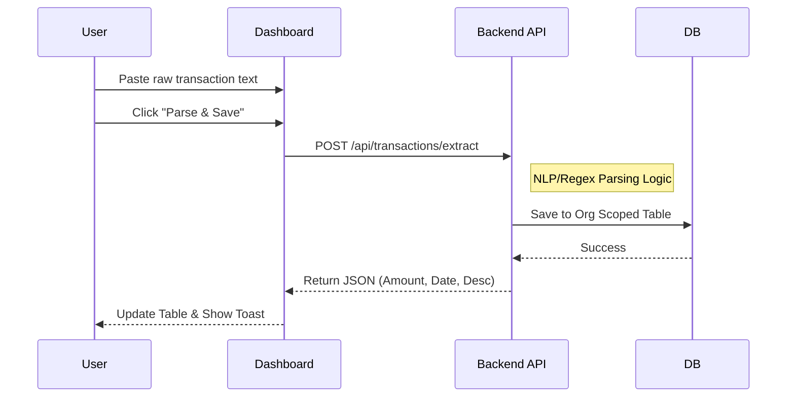

# 🎨 Financial Transaction Parser - Frontend

[](https://nextjs.org/)
[](https://react.dev/)
[](https://tailwindcss.com/)
[](https://ui.shadcn.com/)

A modern, responsive user interface for managing and parsing financial transactions.

## ✨ Features

- **🔐 Secure Auth:** Integrated with Better Auth for seamless login and organization management.
- **🏢 Multi-Tenancy:** Easily switch between organizations.
- **📝 Smart Parsing:** Raw text input parsing into structured transaction data.
- **📊 Activity View:** Paginated history of all transactions.
- **🌙 Dark Mode:** Modern aesthetics with light/dark support.

## 🚀 Getting Started

### Prerequisites

- Node.js (v18+)
- Backend running on `http://localhost:3001`

### Setup Instructions

1. **Install Dependencies**
   ```bash
   npm install
   ```

2. **Environment Variables**
   Create a `.env` file in the root:
   ```env
   NEXT_PUBLIC_API_URL="http://localhost:3001"
   BETTER_AUTH_URL="http://localhost:3000"
   NEXT_PUBLIC_BETTER_AUTH_URL="http://localhost:3001/api/auth"
   ```

3. **Run Development Server**
   ```bash
   npm run dev
   ```

## 🔄 Transaction Parsing Flow



## 📂 Project Structure

- `app/`: Next.js App Router pages and layouts.
- `components/`: Reusable UI components (Shadcn/UI).
- `lib/`: Utility functions and API client.
- `hooks/`: Custom React hooks for data fetching.
```
